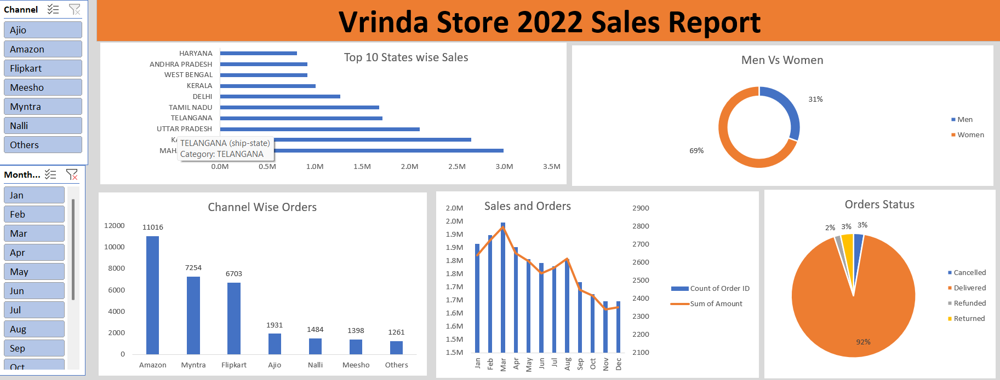

# Vrinda Store Sales Analysis Dashboard

## Project Overview

This project analyzes the 2022 sales performance of Vrinda Store using Microsoft Excel.
The goal is to identify key insights related to sales distribution, customer demographics, order channels, and order status to support better business decision-making.

## Tools Used

* Microsoft Excel
* Pivot Tables
* Pivot Charts
* Slicers
* Excel Dashboard Design

## Dataset

The dataset contains sales transactions for Vrinda Store including:

* Order ID
* Sales Amount
* Order Channel
* Order Status
* State
* Gender
* Month
* Category

## Key Dashboard Features

### Sales by State

Identifies the top-performing states contributing to total revenue.

### Gender-based Sales Distribution

Compares purchasing behavior between men and women customers.

### Channel-wise Orders

Analyzes which platforms generate the highest number of orders (Amazon, Myntra, Flipkart, etc.).

### Monthly Sales Trend

Shows how sales and orders vary across months to detect seasonality.

### Order Status Distribution

Displays percentage of orders delivered, cancelled, refunded, or returned.

### Interactive Filters

The dashboard includes slicers for:

* Sales Channel
* Month

These filters allow users to dynamically explore the data.

## Key Insights

* Maharashtra generated the highest sales among all states.
* Women customers contributed approximately 69% of total purchases.
* Amazon was the largest order channel.
* Most orders were successfully delivered (around 92%).
* Sales showed strong performance in the early months of the year.

## Dashboard Preview



## Project Structure

```
vrinda-store-sales-analysis
│
├── data
│   └── vrinda_store_data.xlsx
│
├── dashboard
│   └── vrinda_sales_dashboard.xlsx
│
├── images
│   └── dashboard_preview.png
│
└── README.md
```

## Author

Durga Prasad Keshri
Aspiring Data Analyst

